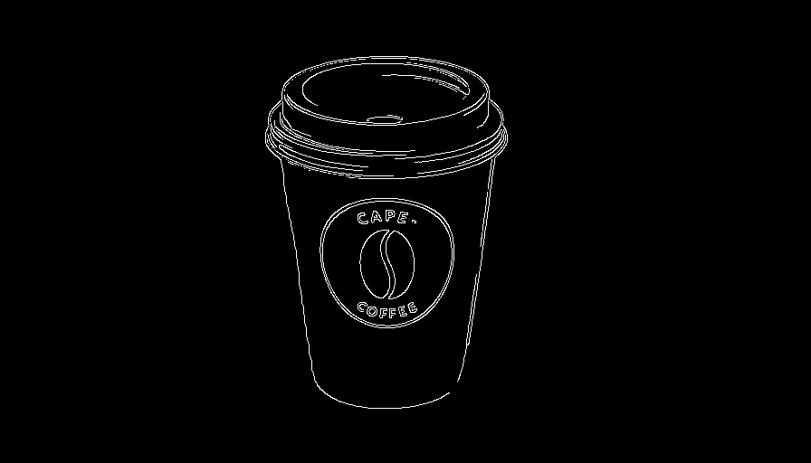
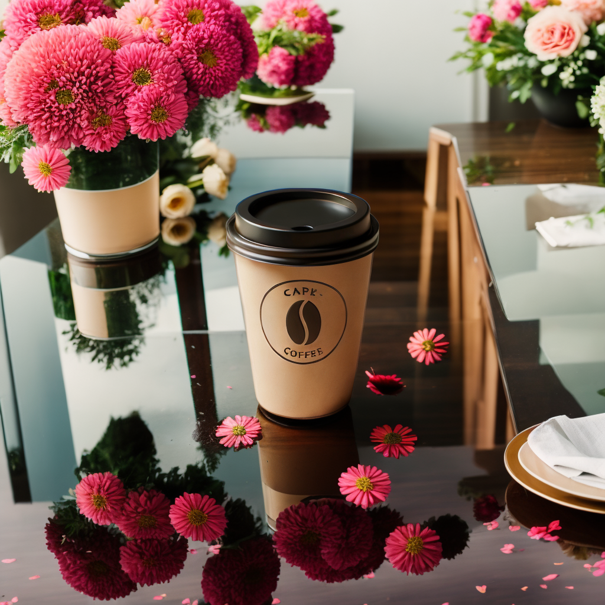

# Stable Diffusion Workspace

A comprehensive Stable Diffusion implementation featuring advanced inpainting, ControlNet integration, automated background removal, and upscaling capabilities. This workspace combines multiple state-of-the-art models to deliver professional-grade image generation and manipulation.

## 📋 Table of Contents

- [Overview](#overview)
- [Key Features](#key-features)
- [Architecture](#architecture)
- [Technologies](#technologies)
- [Installation](#installation)
- [Usage](#usage)
- [Examples](#examples)
- [Parameters](#parameters)
- [Output](#output)
- [Limitations](#limitations)

## 🔍 Overview

This project leverages **Stable Diffusion** models for robust image inpainting, **ControlNet** for enhanced stability and control, and **Rembg** for precise foreground segmentation. The implementation provides a complete solution for advanced image generation, manipulation, and enhancement tasks.

### Core Capabilities

- **Image Inpainting**: Fill masked regions with AI-generated content
- **Background Removal**: Automatic foreground segmentation using Rembg
- **Depth-Based Control**: ControlNet integration for depth-aware generation
- **Edge Detection**: Canny edge detection for structural guidance
- **2x Upscaling**: Sequential model inference for resolution enhancement
- **Fooocus Integration**: Simplified interface for SDXL image generation

## ✨ Key Features

### 1. **Intelligent Background Removal**
Uses the Rembg model to automatically segment foreground objects from backgrounds, creating precise masks for inpainting operations.

### 2. **ControlNet Integration**
- **Depth Control**: Processes depth perception maps using Intel's DPT-Large model
- **Inpaint Control**: Specialized ControlNet for inpainting tasks
- Enhanced stability and coherence in generated outputs

### 3. **Advanced Inpainting Pipeline**
- Combines Stable Diffusion with ControlNet for superior results
- Supports custom prompts and negative prompts
- Maintains structural integrity using depth and edge information

### 4. **2x Image Upscaling**
Sequential pipeline approach:
1. Generate base image at target resolution
2. Extend canvas by 2x
3. Inpaint extended regions for seamless upscaling

### 5. **Fooocus Colab**
Simplified SDXL image generation interface optimized for Google Colab environments with pre-configured settings and optimizations.

## 🏛️ Architecture


### Processing Flow


## 🛠️ Technologies

### Core Models

| Model | Purpose | Version |
|-------|---------|---------|
| **Stable Diffusion** | Image generation and inpainting | RealisticVision V5.1 VAE |
| **ControlNet** | Depth control | sd-controlnet-depth |
| **ControlNet** | Inpaint control | control_v11p_sd15_inpaint |
| **Rembg** | Background removal | Latest |
| **DPT-Large** | Depth estimation | Intel/dpt-large |
| **Fooocus** | SDXL generation | Latest |

### Frameworks & Libraries

- **PyTorch** - Deep learning framework
- **Diffusers** - Hugging Face diffusion models
- **Transformers** - Model pipelines
- **OpenCV** - Image processing
- **NumPy** - Numerical operations
- **PIL/Pillow** - Image I/O

## 📦 Installation

### Prerequisites

- Python 3.8+
- CUDA-capable GPU (recommended 8GB+ VRAM)
- CUDA Toolkit 11.8+

### Setup

```bash
# Clone the repository
git clone https://github.com/baloglu321/Stable-diffision-workspace.git
cd Stable-diffision-workspace

# Install dependencies
pip install torch torchvision --index-url https://download.pytorch.org/whl/cu118
pip install diffusers transformers accelerate
pip install rembg opencv-python pillow numpy

# For Fooocus (Colab)
# Open fooocus_colab.ipynb in Google Colab
```

## 🚀 Usage

### Basic Image Generation

```bash
python Image_generation_with_stb_diff.py \
    --image_path image.jpg \
    --prompt "flowers and flower petals on table, reflection in background" \
    --negative_prompt "deformed, blurry, low quality, cartoon" \
    --width 512 \
    --height 512 \
    --step_size 42 \
    --save_folder images/ \
    --save_name output.png
```

### With Upscaling

```bash
python Image_generation_with_stb_diff.py \
    --image_path image.jpg \
    --prompt "professional product photography, studio lighting" \
    --width 1024 \
    --height 1024 \
    --upscale True \
    --step_size 50
```

### Using Default Image Size

```bash
# If width and height are 0, uses input image dimensions
python Image_generation_with_stb_diff.py \
    --image_path image.jpg \
    --prompt "beautiful landscape with mountains"
```

### Fooocus (Google Colab)

1. Open `fooocus_colab.ipynb` in Google Colab
2. Run the setup cells to install dependencies
3. Launch the Gradio interface
4. Generate images through the web UI

## 📸 Examples

### Background Removal & Segmentation


*Automatically generated segmentation mask using Rembg*

### Depth Map Generation


*Depth map generated using Intel DPT-Large model*

### Canny Edge Detection


*Edge detection for structural guidance*

### Generated Outputs

````carousel

*Base generation at 512x512 resolution*
<!-- slide -->

*High-resolution generation at 1024x1024*
<!-- slide -->

*Advanced inpainting with depth control*
<!-- slide -->

*Multiple style variations with same mask*
<!-- slide -->

*Edge-guided generation preserving structure*
<!-- slide -->

*2x upscaled output with seamless inpainting*
````

## ⚙️ Parameters

### Command-Line Arguments

| Parameter | Type | Default | Description |
|-----------|------|---------|-------------|
| `--image_path` | str | `image.jpg` | Input image file path |
| `--prompt` | str | `reflection in background, flowers...` | Generation prompt |
| `--negative_prompt` | str | `deformed, blurry...` | What to avoid |
| `--width` | int | `0` | Output width (0 = auto from input) |
| `--height` | int | `0` | Output height (0 = auto from input) |
| `--step_size` | int | `42` | Number of inference steps |
| `--seed` | int | random | Random seed for reproducibility |
| `--upscale` | bool | `False` | Enable 2x upscaling |
| `--save_folder` | str | `images/` | Output directory |
| `--save_name` | str | `image{seed}.png` | Output filename |
| `--show` | bool | `True` | Display result window |

### Recommended Settings

**For Quality:**
- Steps: 50-100
- Upscale: True
- Use descriptive prompts

**For Speed:**
- Steps: 20-30
- Upscale: False
- Lower resolutions (512x512)

**For Consistency:**
- Set explicit seed value
- Keep same negative prompt
- Use same model versions

## 📤 Output

The pipeline generates several intermediate files:

- `image_pil.png` - Processed input image
- `seg_image.png` - Segmentation mask
- `depth_image.png` - Depth map
- `cany_image.png` - Canny edge map
- `{save_folder}/{save_name}` - Final output

## ⚠️ Limitations

### Known Issues

1. **Object Distortions**: Potential artifacts in extracted objects
   - Caused by non-custom models or technical constraints
   - Mitigated by using specialized models when available

2. **Noise in Depth Maps**: Can affect generation quality
   - More noticeable with complex scenes
   - Consider pre-processing depth maps for critical applications

3. **Masking Artifacts**: Automatic segmentation may be imperfect
   - Alternative tools: remove.bg, manual masking
   - Consider manual refinement for production use

4. **VRAM Requirements**: 
   - Base generation: ~6GB
   - With upscaling: ~10-12GB
   - Enable memory optimizations for lower VRAM

### Alternative Approaches

- **Background Removal**: remove.bg, PhotoRoom
- **Segmentation**: SAM (Segment Anything Model), U²-Net
- **Depth Estimation**: MiDaS, ZoeDepth
- **Upscaling**: Real-ESRGAN, SwinIR

## 🔬 Technical Details

### Pipeline Configuration

```python
# Scheduler: DDIM for deterministic results
scheduler = DDIMScheduler.from_config(pipe.scheduler.config)

# Precision: FP16 for memory efficiency
torch_dtype = torch.float16

# ControlNet: Depth-based guidance
controlnet = "lllyasviel/sd-controlnet-depth"

# Base Model: Realistic Vision V5.1
model = "Uminosachi/realisticVisionV51_v51VAE-inpainting"
```

### Memory Optimization

- Models use `torch.float16` precision
- Sequential pipeline loading
- Option for CPU offloading (code ready, uncomment if needed)

### Upscaling Strategy

1. Generate at target resolution
2. Extend canvas to 2x dimensions
3. Create mask for new regions (15px border)
4. Use inpaint ControlNet for coherent extension
5. Maintain consistency with original image

## 📚 References

- [Stable Diffusion](https://github.com/CompVis/stable-diffusion)
- [ControlNet](https://github.com/lllyasviel/ControlNet)
- [Rembg](https://github.com/danielgatis/rembg)
- [Fooocus](https://github.com/lllyasviel/Fooocus)
- [Diffusers Library](https://github.com/huggingface/diffusers)

## 📝 Notes

- **GPU Required**: CPU inference is extremely slow
- **First Run**: Models will be downloaded (~8-10GB total)
- **Seed Control**: Use `--seed` parameter for reproducible results
- **Batch Processing**: Modify script to process multiple images

---

**Author**: Mehmet  
**Created**: November 2023  
**License**: For educational and research purposes

